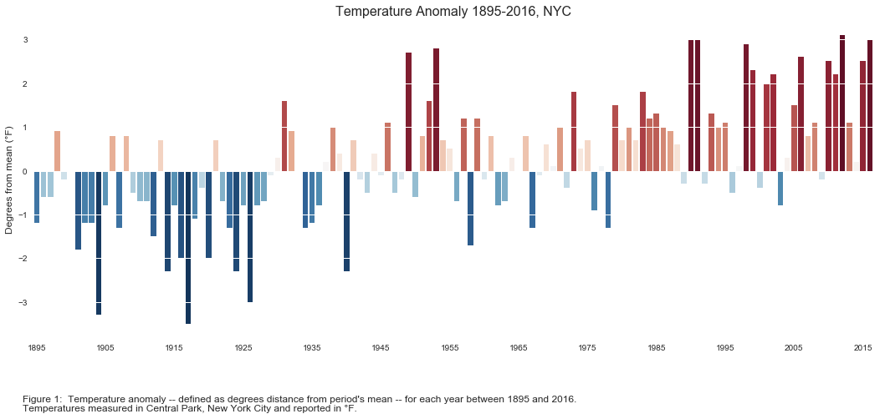

# Peer Review for Bianca Brusco (bb1569)

## Reviewer: Baoling Zhou (bz882)

## Comments

### Clarity

-   The graph is good to understand with the help of bottom detailed caption.
-   It is easy to see how many degrees each bar represents with the help of the white-colored dividers. 

[Suggestion]

-   I was confused at beginning to understand what the period’s mean represent. It cannot be specified more clearly in the bottom caption.

### Aesthetic

-   The red-blue color combination is easy to recognize. I can even tell that a bar with a higher absolute value goes with a darker color.

[Suggestions]

-   The title and labels can be made bigger.
-   The number of color bars is too many and audiences might get lost during reading. It will be less distracting to combine every five-year span as a color bar by using the average value.

### Honesty

-   There is no obvious outliner in the chart and all the color bars are within around 3-degree distance away from 0.

[Suggestions]

-   It seems that the temperature anomaly changes its direction from cold to hot in 1945. It might be explained by the country’s reconstruction after World War II. It will be great if the author can find out the real reason of this transition and mention it in the bottom caption.